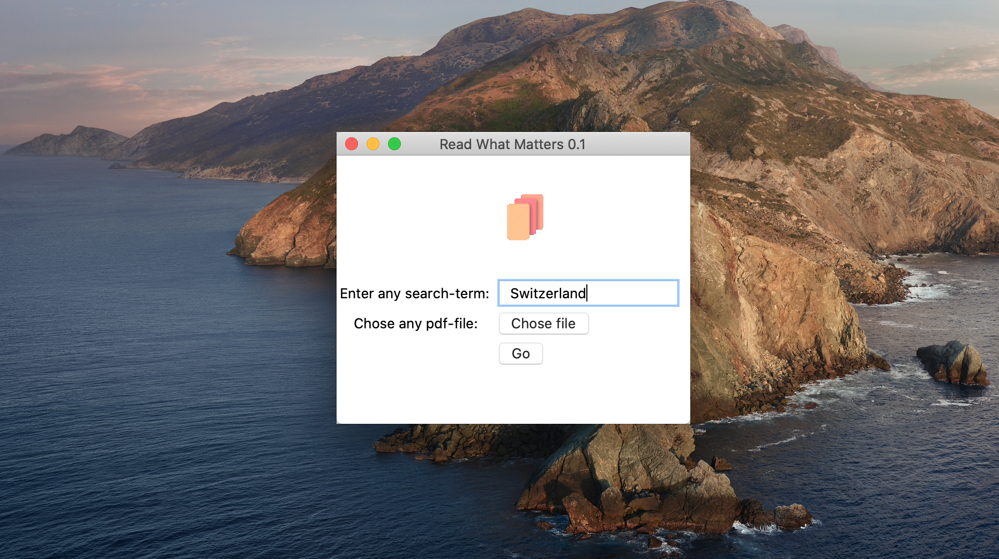

# ReadWhatMatters

## About
ReadWhatMatters is a little Python app that helps you to create a pdf-file from another pdf-file based on a certain search term. 

## Upcoming Features
* search for multiple terms at once
* include context of the previous page in the final pdf

